# Type Annotation challenge

## BASIC

### 1. Any

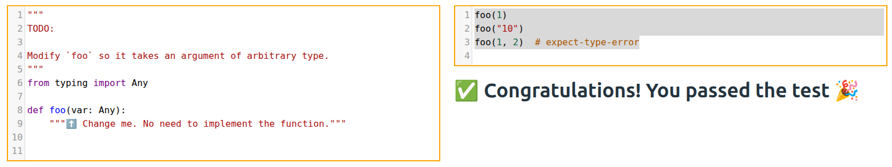

### 2. Dict

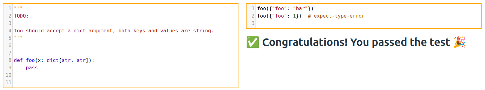

### 3. Final

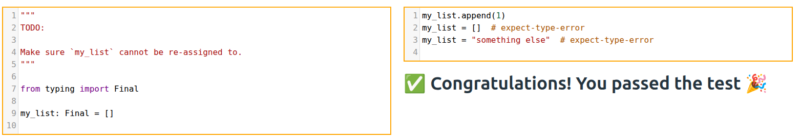

### 4. **kwargs

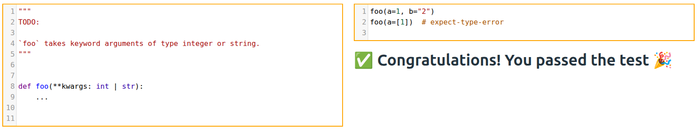

### 5.  List

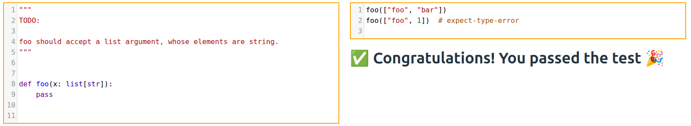

### 6. Optional

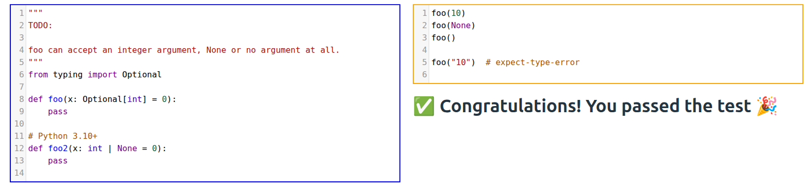

### 7. Parameter

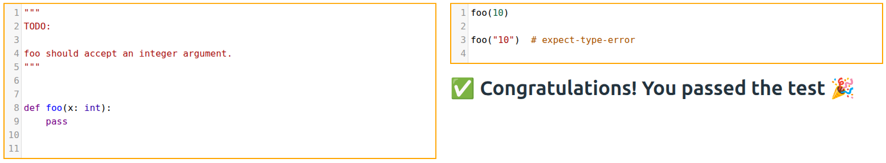

### 8. Return

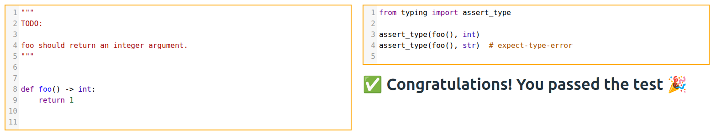

### 9. Tuple

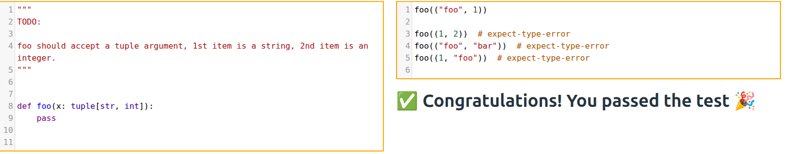

### 10. TypeAlias

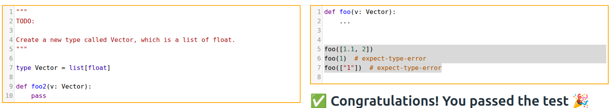
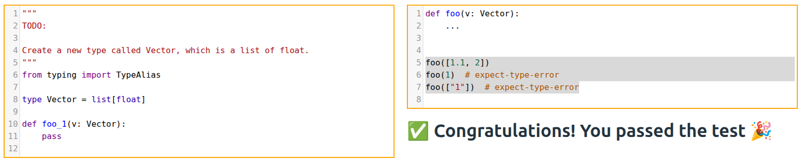

### 11. Union

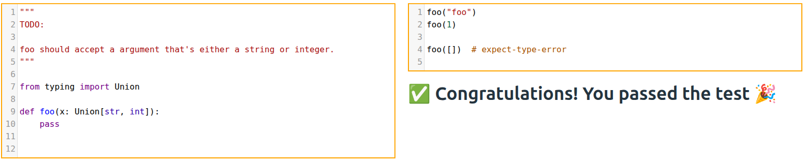

### 12. Variable

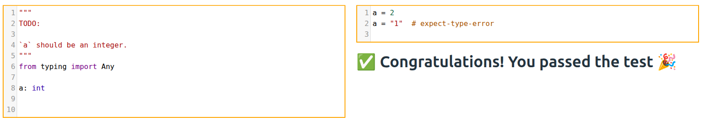

## ADVANCED

### 13. Await
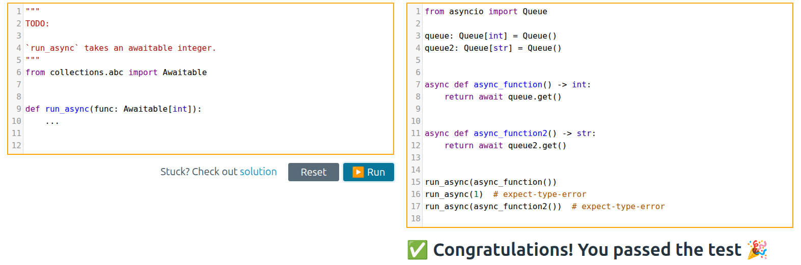

### 14. Callable

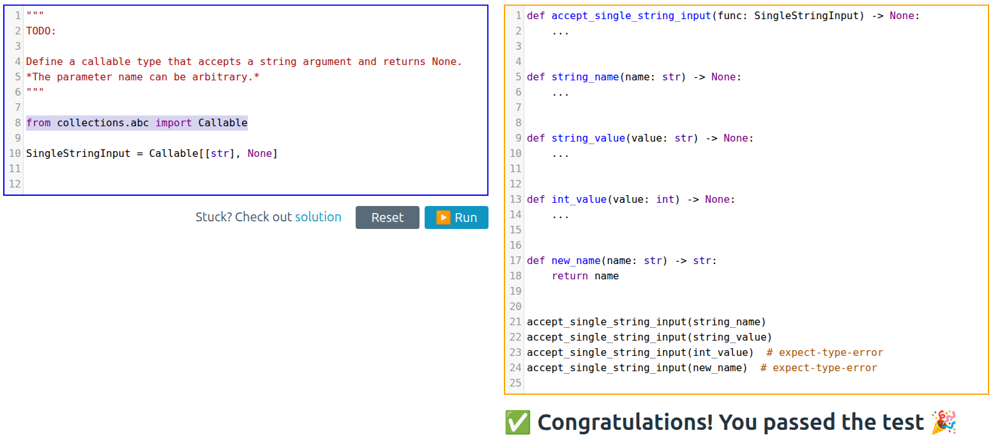

### 15. ClassVar

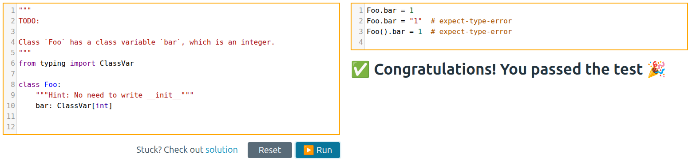]

### 16. Decorator

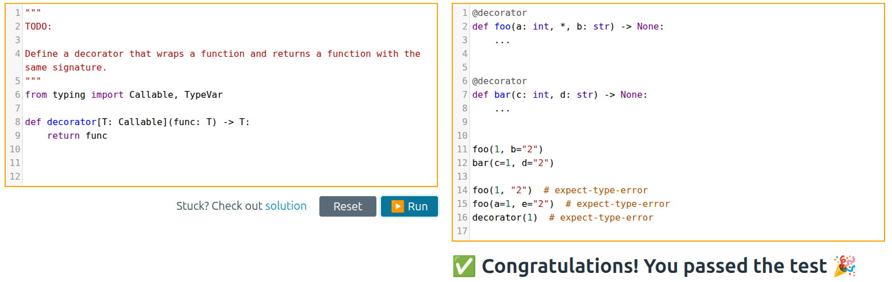

### 17. EmptyTuple

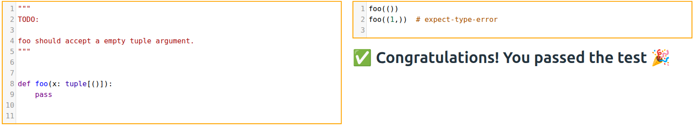

### 18. Generic

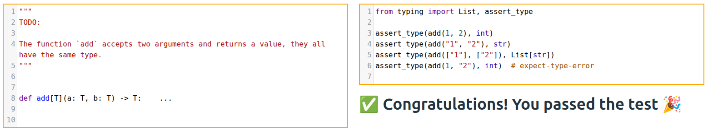

### 19. Generic2

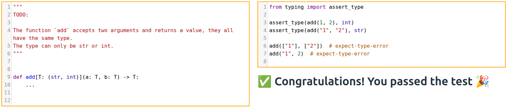

### 20. Generic3

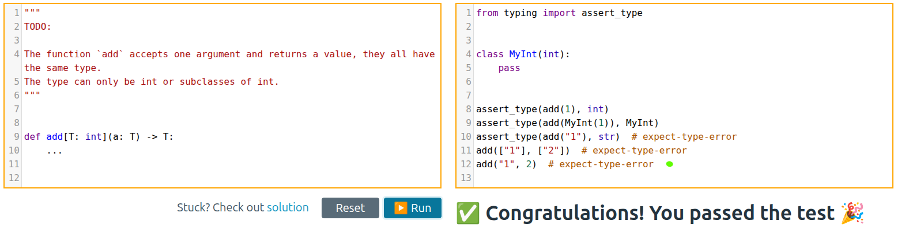

### 21. InstanceVar

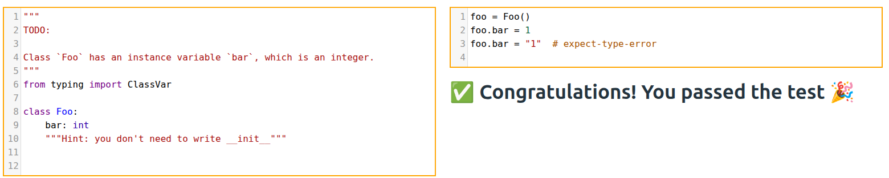

### 22. Literal

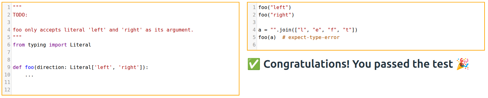

### 23. LiteralString

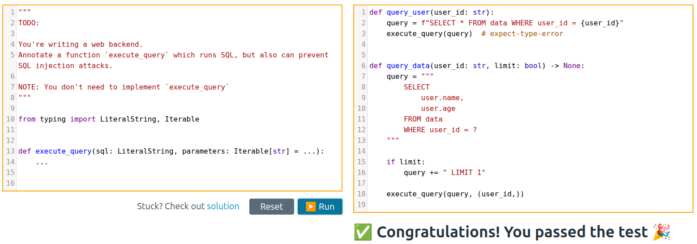

### 24. Self

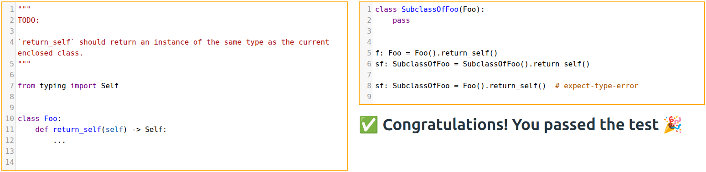

### 25. Dict

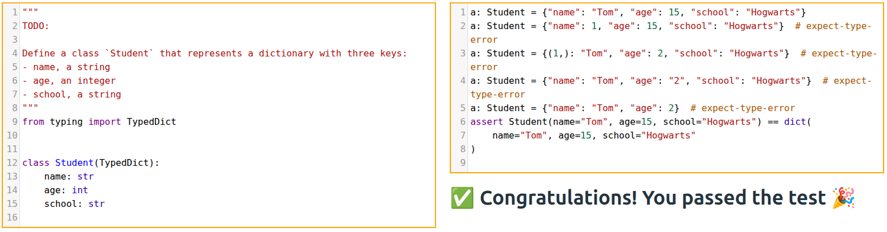

### 26. Dict2

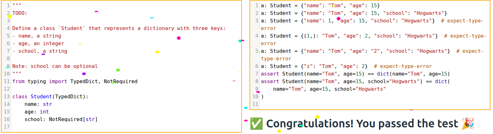

### 27. Dict3

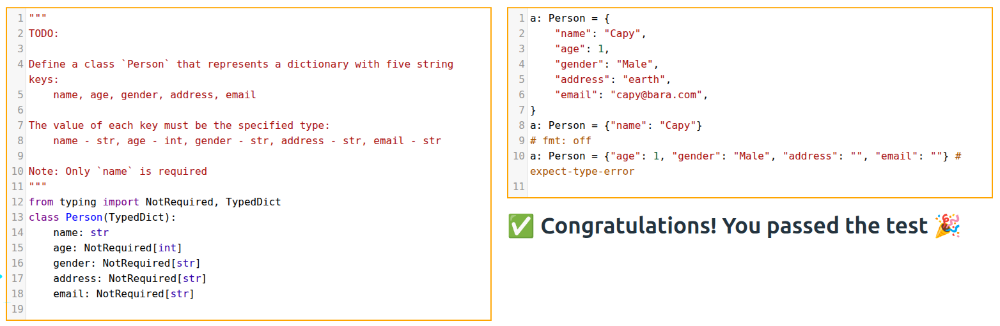

### 28. Unpack

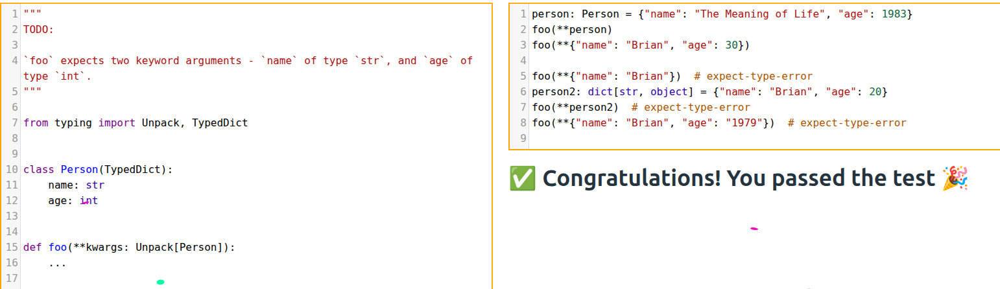

